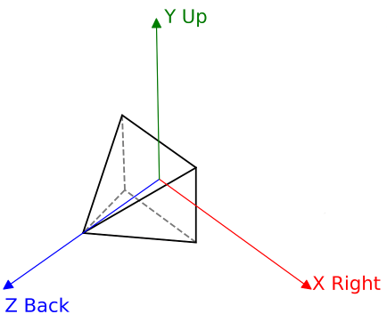

Coordinate system
===========================================================================
**ZeroZero** use a right-handled, y-up coordinate system :

The [in-game debug](004_debug_renderer.md) can display the coordinate system
at run-time.