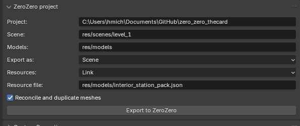
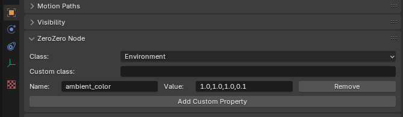

Blender Add-on
===========================================================================

Since **ZeroZero** does not have an editor a Blender add-on is provided
to edit ZeroZero properties of scenes nodes and export a Blender scene
to a ZeroZero scene or resource file. 

Installation
------------------------------------------------------------------------
The add-on support Blender 4.2 and newer version. 
- Open the "Edit" -> "Preferences" dialog
- Click on the "Add-ons" tab
- Open the pop-up menu with the top-right "down arrow" icon
- Click "Install from Disk..."
- Select the python file `src/tools/blender/blender_zero_zero.py`

How to use
------------------------------------------------------------------------

Once installed the add-on add properties to the Blender's scene 
and the Blender's nodes.

### Scene properties
The ZeroZero scene properties are located in the *ZeroZero project* section
of the Blender scene properties :

 

The following common properties can be edited :
- *Project* : the game/project root directory 
- *Scene* : the scene resource directory, relative to the project directory
- *Models* : the models resource directory, relative to the project directory
 

Use the *Export as*  property to select if you want to export the Blender scene
as a ZeroZero scene (JSON format) or as a resource file (glTF ou ZRes with optional JSON).

The *Export to ZeroZero* button run the export process.

**Exporting as a Scene**

When exporting the scene tree as a JSON scene file you can choose if you want to *export*
the resources as glTF or ZRes files with the *Resouces* option or if you want *link*
an existing resource file (allowing you to create multiple scenes with only one set
of resources). 

The *Reconcile and duplicate meshes* option try to detect duplicated meshes in the Blender
scene when they have been created from another scene exported as resource : import the objets or meshes
in the scene with Blender's *Append* function then duplicate objets with SHIFT-D or ALT-D to 
create the scene. It simply removes the version number in the names of the meshes objects created
by Blender and mark the resulting \ref z0::MeshInstance node to be duplicated when the scene is loaded.

See below for other resource exporting options.

**Export as a Resource file**

The properties changes when you export the Blender scene as a resource file :

- *Export resources description* : create a JSON file describing the content (meshes only) of the scene. Mandatory if you want to use this resource file in a JSON scene file (see above for resource file linking).
- *Convert to ZRes* : convert the exported GLB file to a ZRes file then delete the GLB
- *gltf2zres* : the directory of the gltf2zres executable
- *Format* : compression format for color textures
- *Threads* : number of threads for image conversion with gltf2zres (0 = auto)

### Nodes properties

#### All nodes
The ZeroZero node properties are located in the *ZeroZero Node* section
of the Blender node properties :

 

Here you can change the node class with a ZeroZero built-in class or
input a custom class name (must be registered with the `Z0_REGISTER_TYPE`macro in the game). 

You can add a property with the *Add Custom Property* button. 
Each property must have a *Name* and a *Value*. The variable `$$` can be used in the *Value* field to refer to the selected node name.
This properties must be supported by the `setProperty` function of the
corresponding class (including inheritance).
 

The following objects properties are exported in the GLB or ZScene file, you don't have to add them :
- *position*
- *rotation*
- *scale*

#### Lights nodes
You can create lights in the ZeroZero scene using empty nodes (see below)
but you can also create them with Blender lights object. 
All Blender light object are automatically converted to ZeroZero \ref z0::Light nodes.
The following blender properties are used during the export :
- *color*
- *position*
- *rotation*
- *Light type* : Point -> \ref z0::OmniLight, Sun -> \ref z0::DirectionalLight, Spot -> \ref z0::SpotLight
- *Shadow* : \ref z0::Light::setCastShadows()
- *Custom Distance*, *Distance* : \ref z0::OmniLight::setRange()
- *Beam Shape*, *Size* : \ref z0::SpotLight::setFov()

#### Empty nodes
You can add *Empty*, *Plain axes* nodes in blender to add any ZeroZero node in 
the final scene. 

The main uses of empty nodes are :
- Create ZeroZero resources objets like \ref z0::Environment, \ref z0::Skybox
- Create static bodies detached from meshes nodes, for example to create a floor composed by multiple tiles.

Example for a \ref z0::Environment node : 
