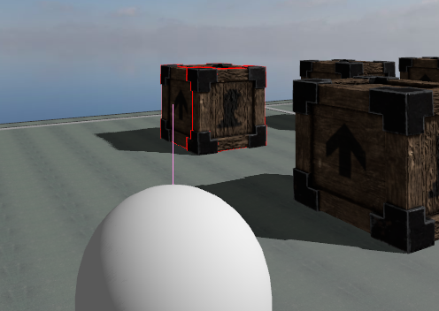

In-game Debug
===========================================================================

Configuration
-----------------------------------------------------------------------------
The in-game debug is automatically added to the rendering system
if the \ref z0::ApplicationConfig.debug field of the application configuration is `true`.
It uses the \ref z0::ApplicationConfig.debugConfig field as configuration.

To avoid too much loss in performance during debugging phase the debug information
to display are not updates each frame but only when \ref z0::DebugConfig.updateDelay has passed.

The default configuration only displays the collision shapes of all collision objects.

Features
-----------------------------------------------------------------------------
The in-game debug can display various information about the physic system and,
except for the ray casts, uses the [Jolt Physics](https://jrouwe.github.io/JoltPhysics/) debug system. 

Examples of debug display :

The coordinate system

 

The rays of all the ray casts

 

The collision shapes of all the collision objects nodes

 