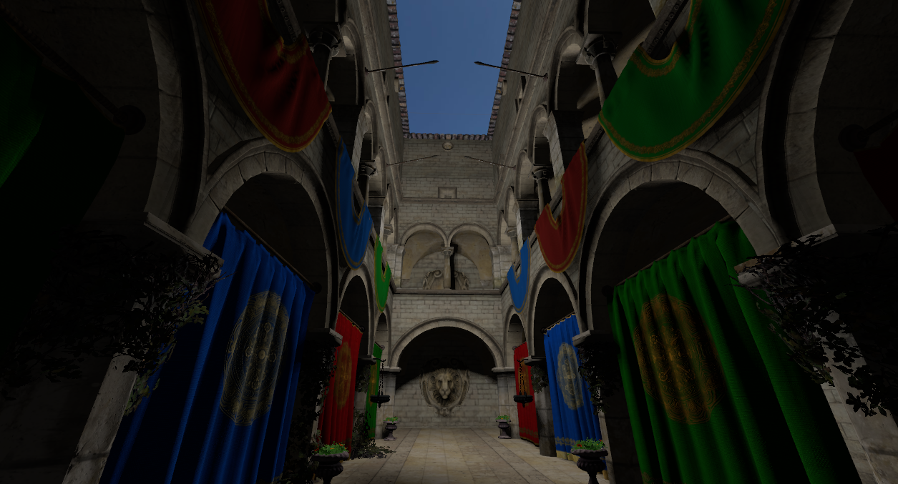
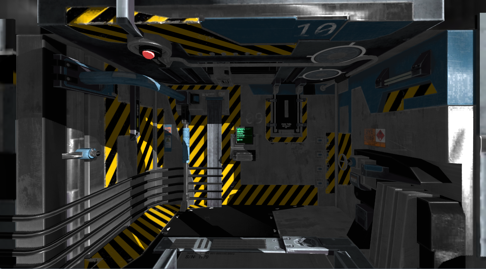
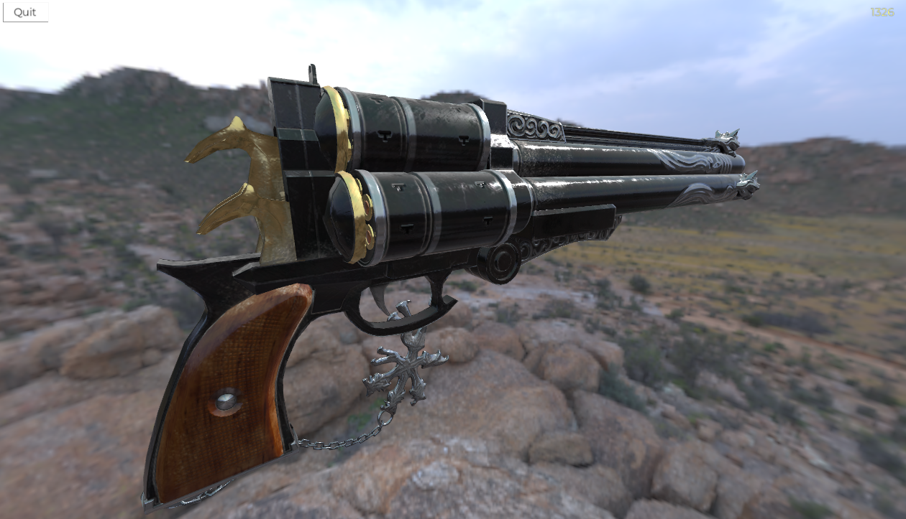
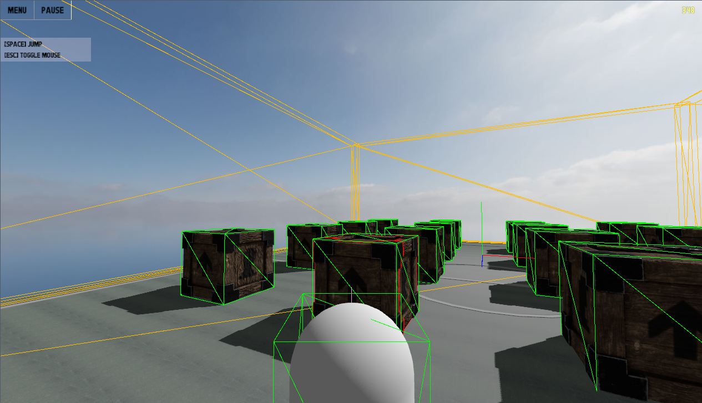

User documentation
===========================================================================

ZeroZero is a 3D game engine based on [Vulkan 1.3](https://www.vulkan.org/) and [Jolt 5.x](https://github.com/jrouwe/JoltPhysics) made in Modern C++ for learning purpose.

Released under the [MIT license](https://raw.githubusercontent.com/HenriMichelon/zero_zero/main/LICENSE.txt).

Features
---------------------------------------------------------------------------
Some of the features actually implemented or under construction :

- Vulkan based forward rendering system with optional depth pre-pass and multisampling.
- Scene tree with classic, object-oriented node system (inspired by [Godot](https://docs.godotengine.org), including the signal system).
- Physic system based on [Jolt Physics](https://github.com/jrouwe/JoltPhysics).
- PBR materials & shader.
- Shader-based materials.
- HDR tone mapping.
- Frustum culling.
- [In-game debug](004_debug_renderer.md)
- [Blender add-on](003_blender_add_on.md)
- JPEG/PNG and HDRi skybox.
- Directional lights, omni (point) lights and spotlights.
- Image based lighting for HDRi skybox.
- Cascaded shadow maps for directional lights.
- Cubemap shadow maps for omni lights.
- [JSON scene](002_file_formats.md) files.
- [glTF](002_file_formats.md) support.
- [ZRes](002_file_formats.md) binary file format for better loading time and decreased VRAM usage.
- UI framework 
- Animations

Examples
---------------------------------------------------------------------------
- [Template project](https://github.com/HenriMichelon/zero_zero_template)
- [Examples repository](https://github.com/HenriMichelon/zero_zero_examples)

Screenshots
---------------------------------------------------------------------------
Example level with tunnel, doors and rooms (with [Space Colony Modular Kit Bash](https://www.fab.com/listings/13206d95-b723-4ff3-a1ce-577d8259480b)):

Classic Sponza with one OmniLight:

[VR Room](https://sketchfab.com/3d-models/unreal-vr-room-01-f7c42add167045a2bcb88d921ea9fd61) with one DirectionalLight:

[Cerberus](https://sketchfab.com/3d-models/cerberusffvii-gun-model-by-andrew-maximov-d08c461f8217491892ad5dd29b436c90) with IBL :

[Collision objects debug](004_debug_renderer.md) :

Contact
---------------------------------------------------------------------------
For more information, contact the project maintainers at [GitHub project page](https://github.com/HenriMichelon/zero_zero)

Vulkan extensions and third parties dependencies used
---------------------------------------------------------------------------
- [Dynamic rendering](https://docs.vulkan.org/samples/latest/samples/extensions/dynamic_rendering/README.html) (VK_KHR_dynamic_rendering)
- [Shader object](https://docs.vulkan.org/samples/latest/samples/extensions/shader_object/README.html) (VK_EXT_shader_object)
- [volk](https://github.com/zeux/volk) to load Vulkan functions
- [VulkanMemoryAllocator](https://github.com/GPUOpen-LibrariesAndSDKs/VulkanMemoryAllocator) for Vulkan buffers allocations
- [glm](https://github.com/g-truc/glm) for mathematics
- [stb](https://github.com/nothings/stb) for image loading and glyph rendering
- [fastgltf](https://github.com/spnda/fastgltf) for glTF scene loading
- [Jolt Physics](https://github.com/jrouwe/JoltPhysics) for the physics system
- [meshoptimizer](https://github.com/zeux/meshoptimizer) for meshes optimization

